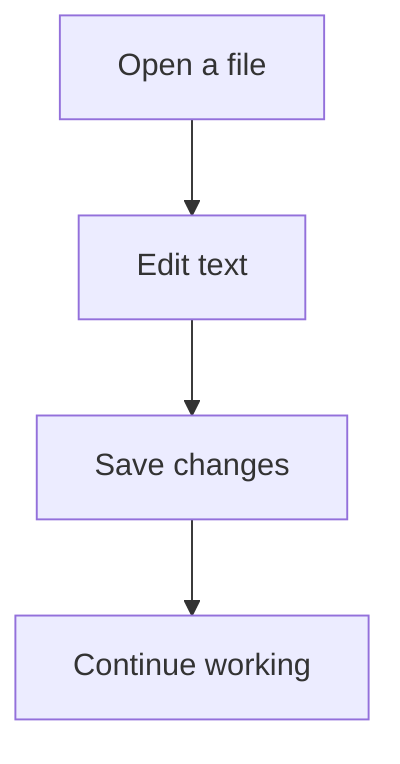
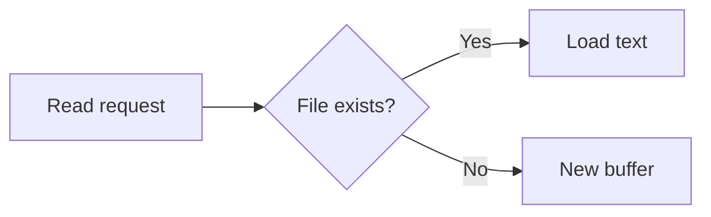

# Mermaid flowcharts

A simple flowchart drawn with terminal characters.

```mermaid
flowchart TD
    Open[Open a file] --> Edit[Edit text]
    Edit --> Save[Save changes]
    Save --> Done[Continue working]
```

## A branch

```mermaid
flowchart LR
    Start[Read request] --> Choice{File exists?}
    Choice -->|Yes| Load[Load text]
    Choice -->|No| Create[New buffer]
```

Use the source toggle to edit the diagram's Mermaid definition.
