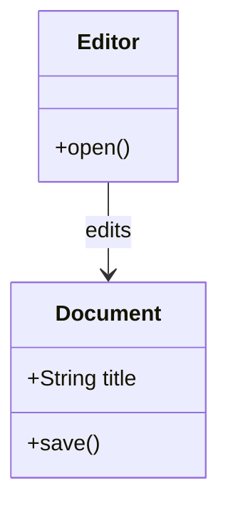
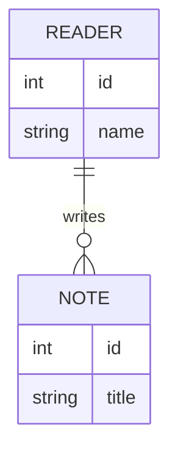
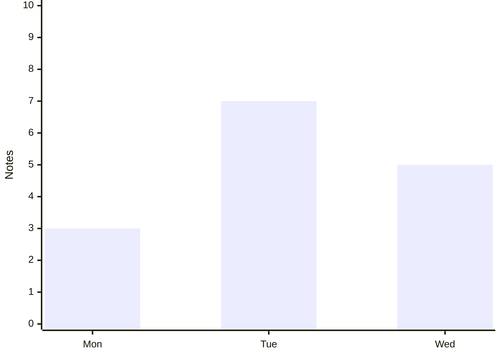

# Data relationships

## Classes

```mermaid
classDiagram
    class Document {
        +String title
        +save()
    }
    class Editor {
        +open()
    }
    Editor --> Document : edits
```

## Entity relationships

```mermaid
erDiagram
    READER ||--o{ NOTE : writes
    READER {
        int id
        string name
    }
    NOTE {
        int id
        string title
    }
```

## A small chart

```mermaid
xychart-beta
    x-axis [Mon, Tue, Wed]
    y-axis "Notes" 0 --> 10
    bar [3, 7, 5]
```
