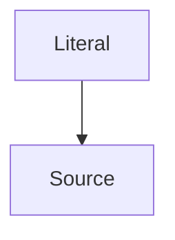

# Fence boundaries and fallbacks

## Tilde fences

~~~rust
let answer = 42;
println!("{answer}");
~~~

## Code-fence attributes

The language still controls highlighting when extra information follows it.

```rust title="greeting.rs"
fn main() { println!("Hello!"); }
```

## Showing literal Markdown

The inner fence below is sample text, not a diagram to render.

````text

````

## An unknown language

```not-a-language
This stays readable, without invented syntax highlighting.
```

## Code in a quote

> ```rust
> let count = 7;
> println!("{count}");
> ```
