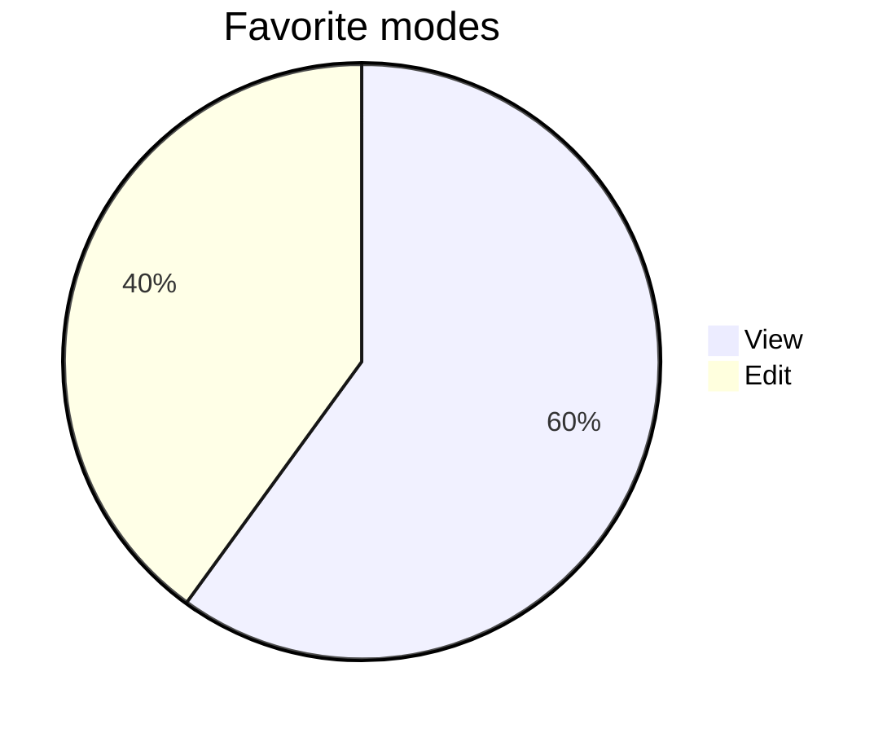

# Readable fallbacks

These examples show the current terminal limitations explicitly.

## Math

Inline math: $x^2 + y^2 = z^2$.

$$
\sum_{n=1}^{4} n = 10
$$

Math remains readable notation, not typeset graphics.

## Images

Images display descriptive text; this sample does not require an image file.

## Other HTML

General HTML remains readable source.

Comments and collapsible details are supported; see `21-details-and-comments.md`.

## An unsupported diagram family

Unsupported Mermaid families retain their source and an explanation.
