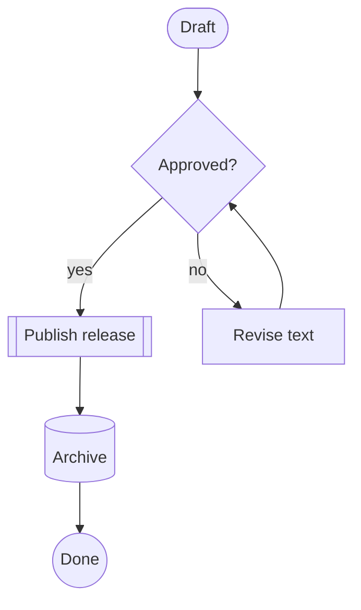
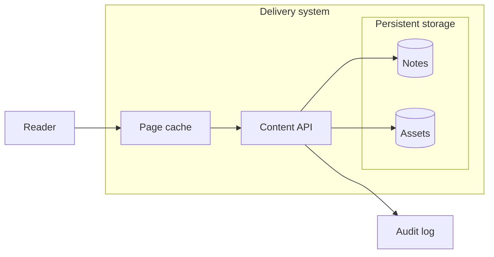
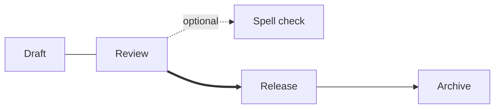
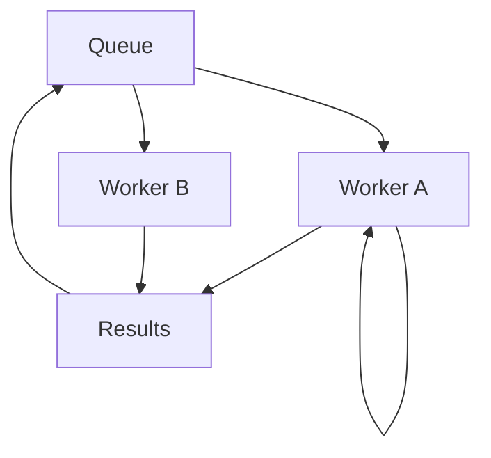
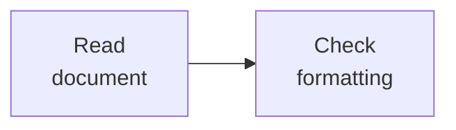

# Flowcharts: shapes, branches, groups, and routes

Scroll horizontally with Left/Right when a layout exceeds the terminal width.

## A publishing pipeline

## Nested groups and cross-boundary connections

## Open, dotted, thick, labeled, and longer edges

## Fan-out, merge, feedback, and a self-loop

## Labels with explicit line breaks

