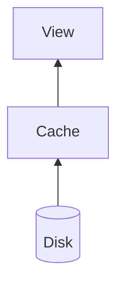
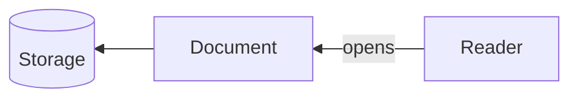
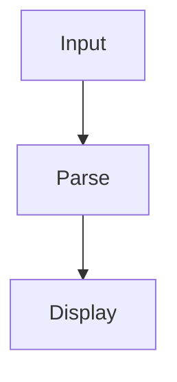
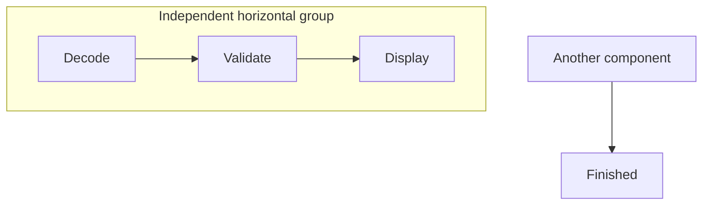

# Flowchart directions

## Bottom to top

```mermaid
flowchart BT
    Disk[(Disk)] --> Cache[Cache] --> View[View]
```

## Right to left

```mermaid
flowchart RL
    Reader[Reader] -->|opens| Document[Document] --> Storage[(Storage)]
```

## The graph and top-to-bottom aliases

```mermaid
graph TB
    Input[Input] --> Parse[Parse] --> Display[Display]
```

## A local left-to-right group inside a vertical graph

```mermaid
flowchart TD
    subgraph Local[Independent horizontal group]
        direction LR
        A[Decode] --> B[Validate] --> C[Display]
    end
    D[Another component] --> E[Finished]
```
