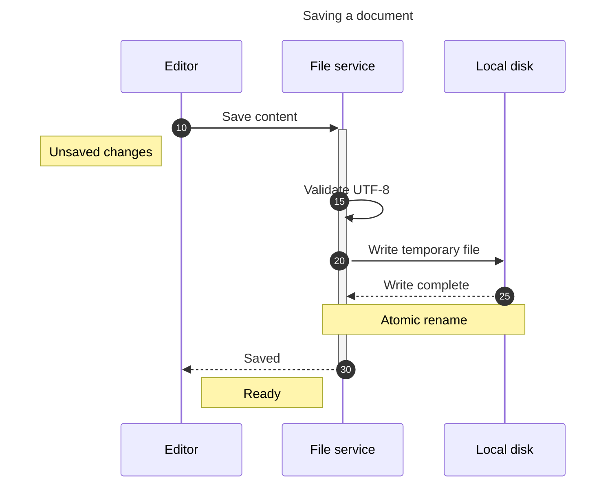
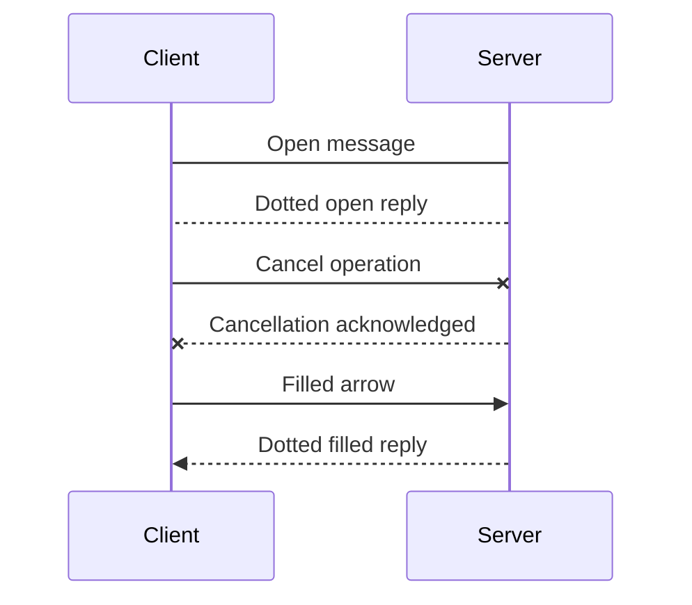
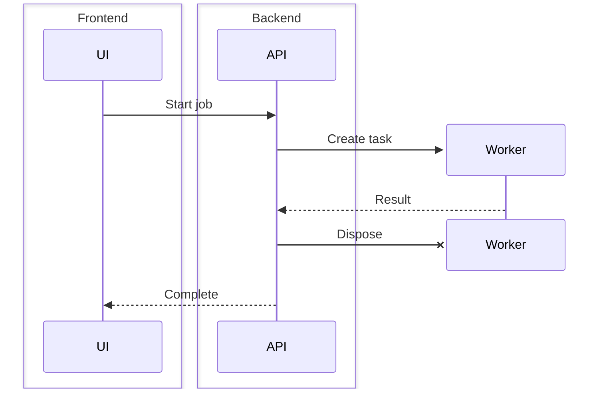
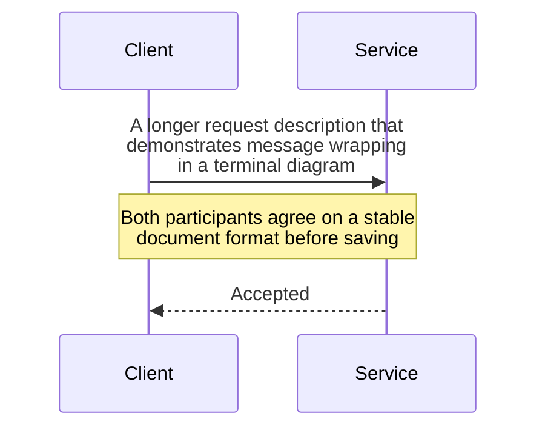

# Sequences: messages, lifecycles, notes, and groups

## Request handling with aliases, activation, and numbering

## Open and cross-ended messages

## Participant groups and temporary workers

## Wrapped message and note text

