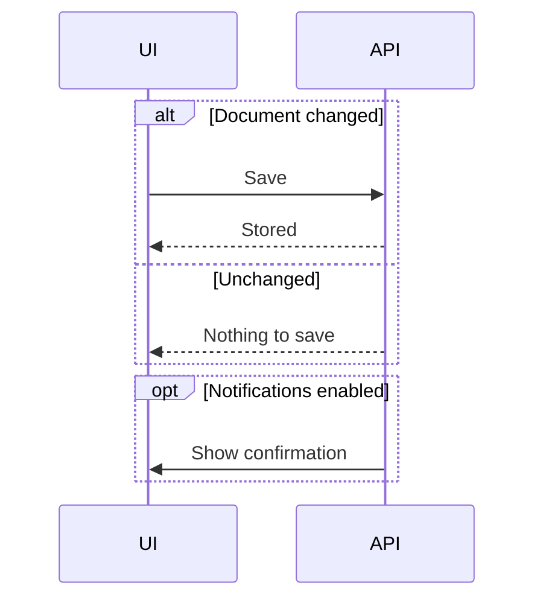
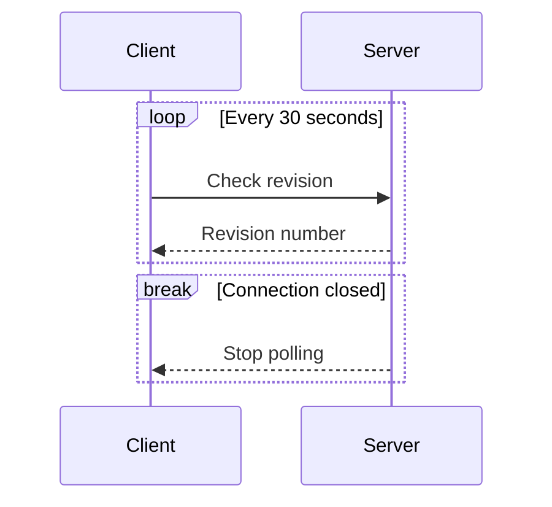
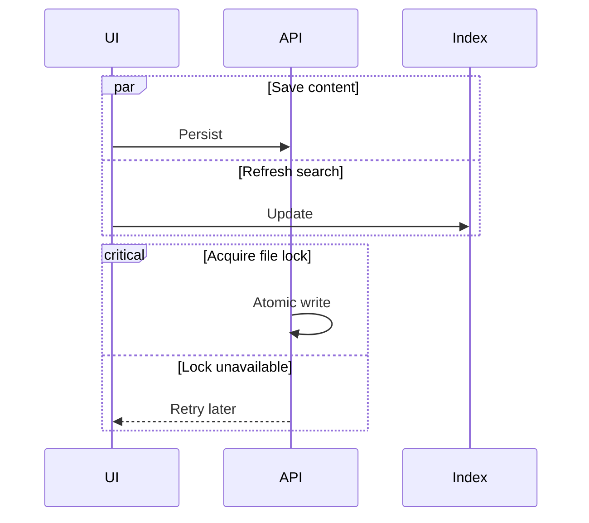
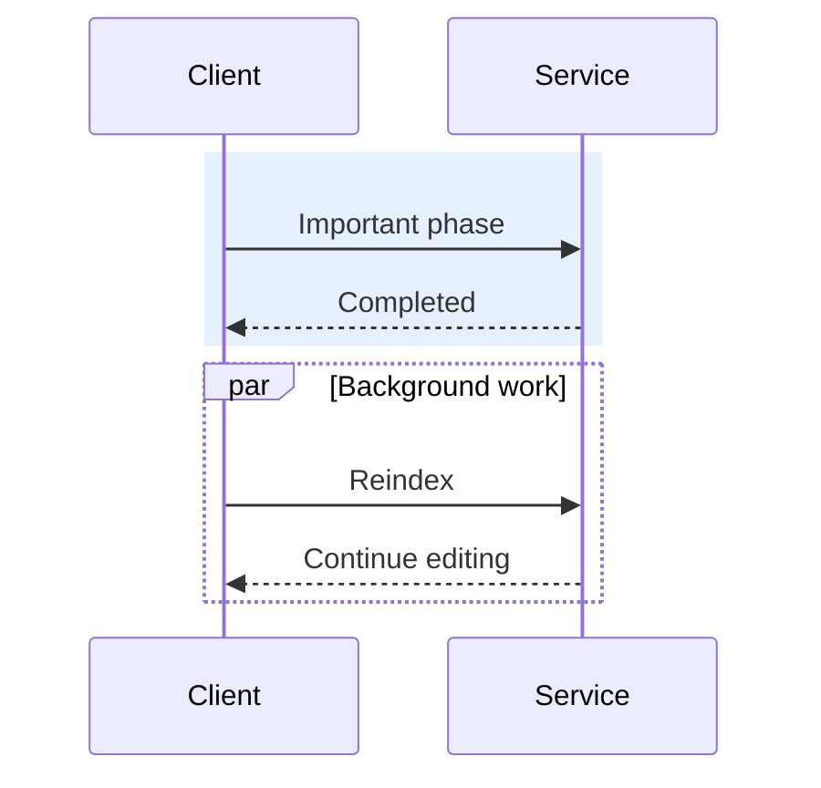

# Sequences: control blocks

Each frame is separate: nested control blocks are currently unsupported.

## Alternative and optional paths

## Loops and early termination

## Parallel work and critical sections

## Highlighted region and overlapping parallel work

