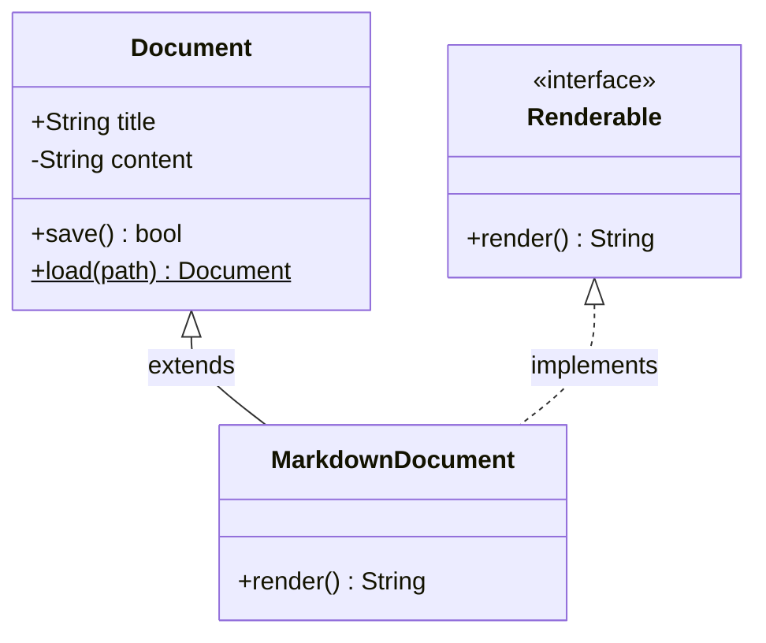
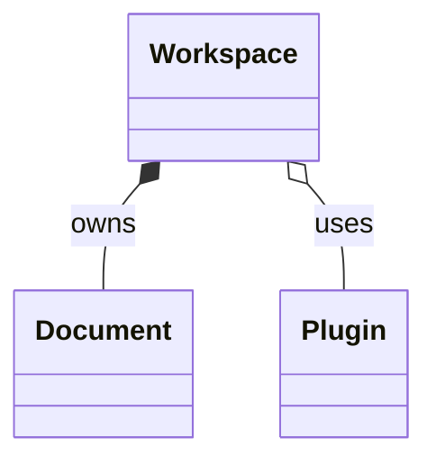
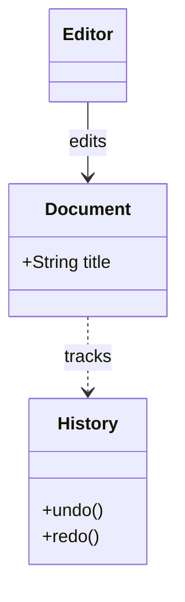
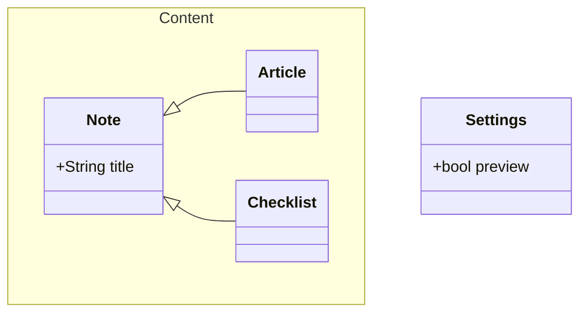

# Classes: members, relationships, and namespaces

## Interfaces, inheritance, and implementation

## Ownership, association, and dependency

## Association and dependency chain

## Namespaces, branching inheritance, and disconnected components

