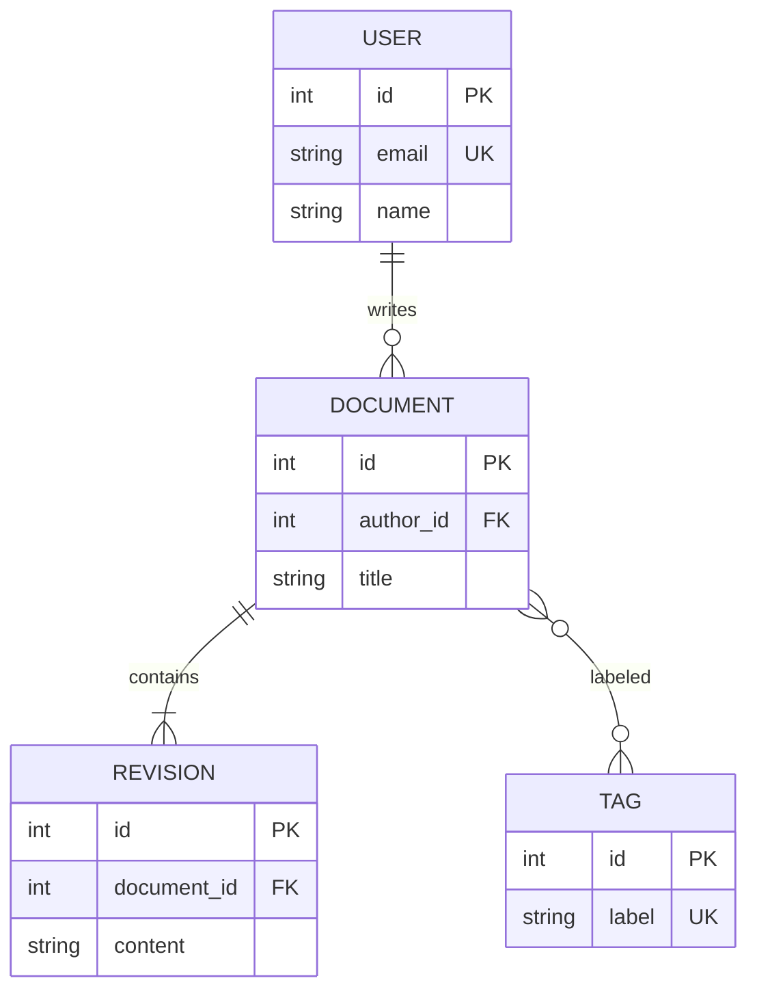
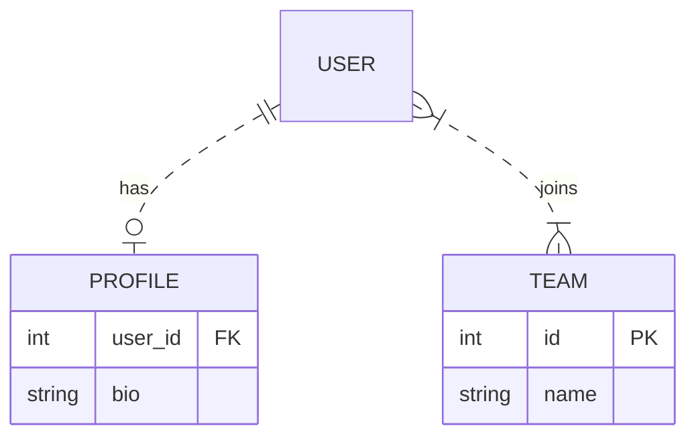
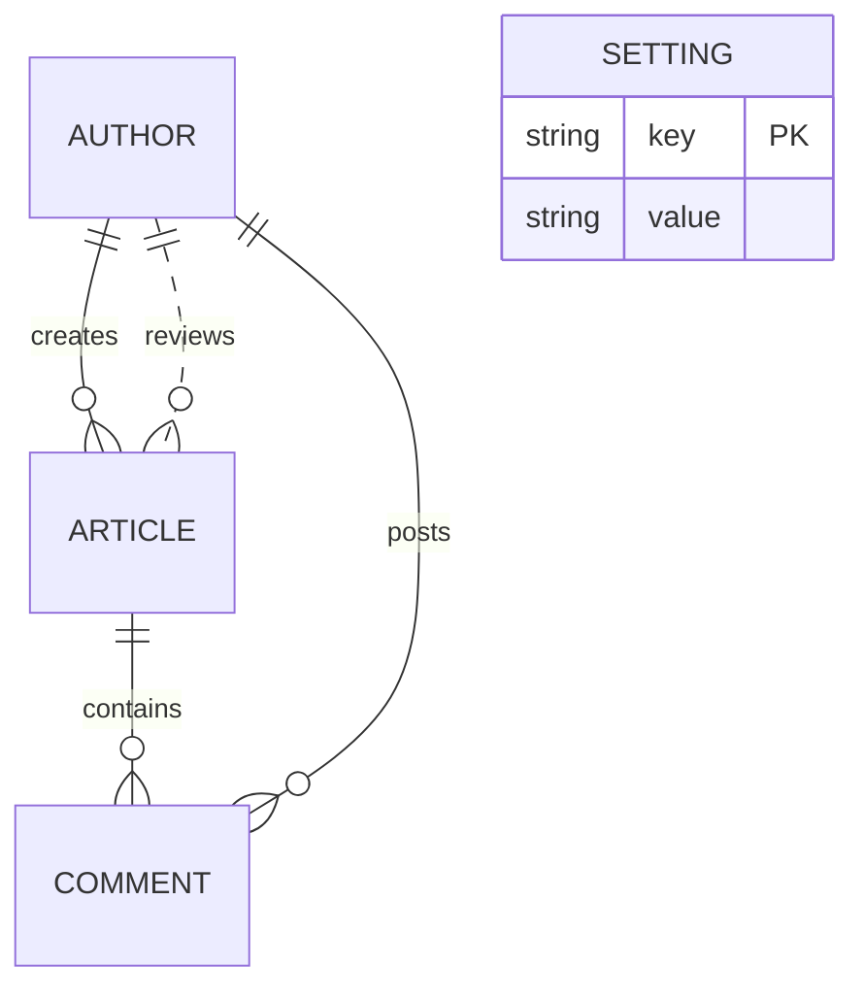

# Entity relationships: keys and cardinalities

## A document workspace

```mermaid
erDiagram
    USER ||--o{ DOCUMENT : writes
    DOCUMENT ||--|{ REVISION : contains
    DOCUMENT }o--o{ TAG : labeled
    USER {
        int id PK
        string email UK
        string name
    }
    DOCUMENT {
        int id PK
        int author_id FK
        string title
    }
    REVISION {
        int id PK
        int document_id FK
        string content
    }
    TAG {
        int id PK
        string label UK
    }
```

## Optional relationships and non-identifying edges

```mermaid
erDiagram
    USER ||..o| PROFILE : has
    USER }|..|{ TEAM : joins
    PROFILE {
        int user_id FK
        string bio
    }
    TEAM {
        int id PK
        string name
    }
```

## Multiple routes and an independent entity

```mermaid
erDiagram
    AUTHOR ||--o{ ARTICLE : creates
    AUTHOR ||..o{ ARTICLE : reviews
    ARTICLE ||--o{ COMMENT : contains
    AUTHOR ||--o{ COMMENT : posts
    SETTING {
        string key PK
        string value
    }
```
