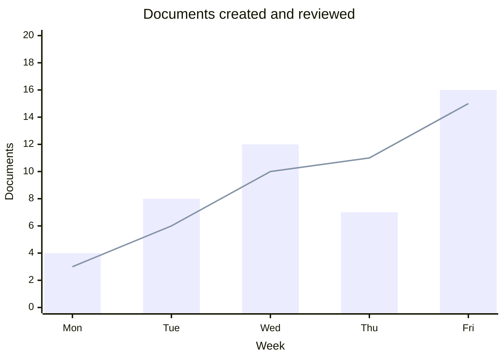
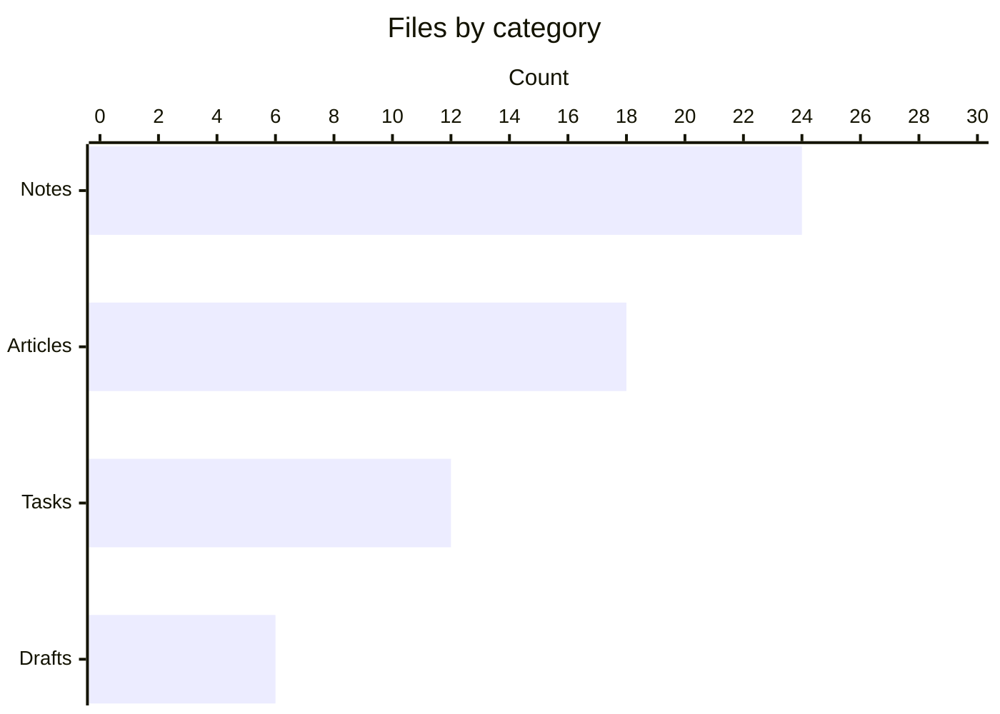
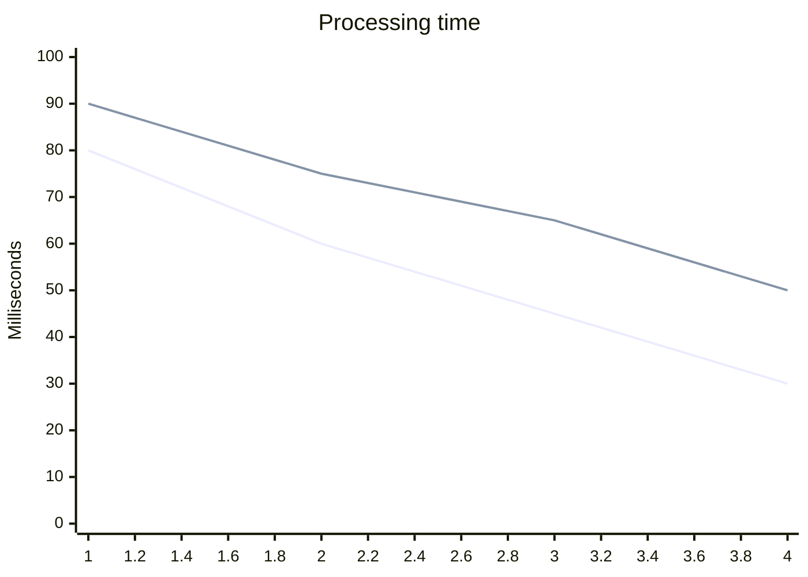

# XY charts: series, axes, orientation, and ranges

## Mixed bars and line series



## Horizontal categories



## Numeric axis and negative values

```mermaid
xychart-beta
    title "Net change"
    x-axis "Day" 1 --> 5
    y-axis "Change" -10 --> 10
    line [-6, -2, 5, 2, 8]
```

## Multiple lines with inferred x labels


