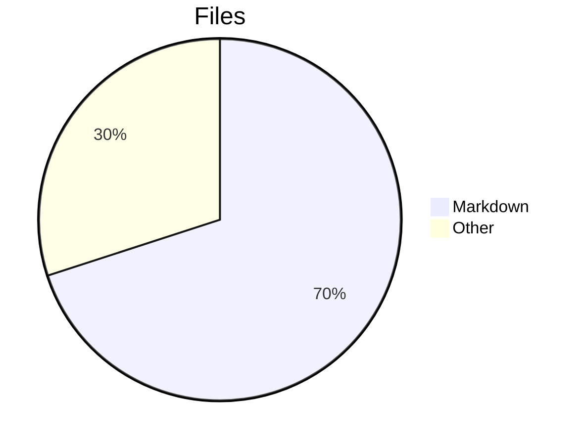
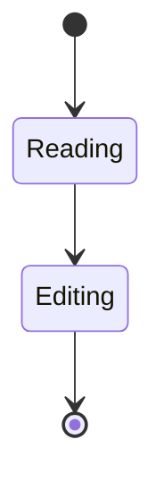
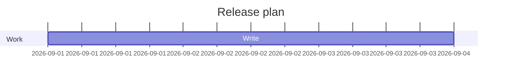
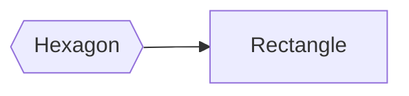
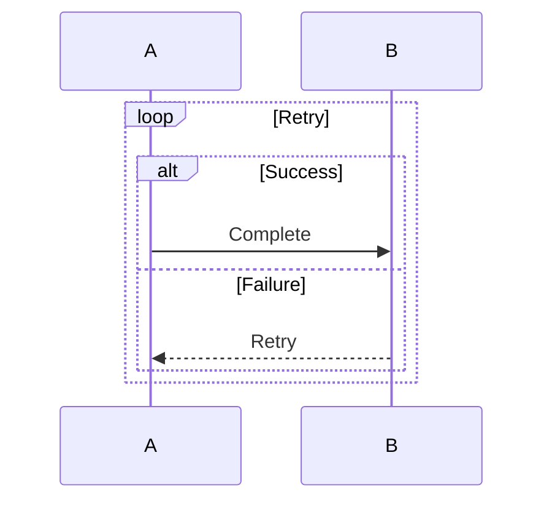
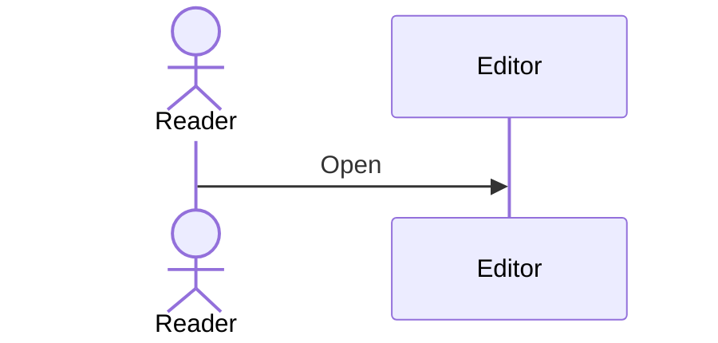
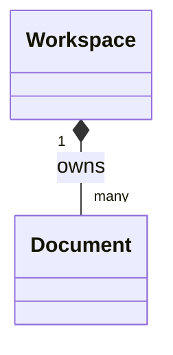
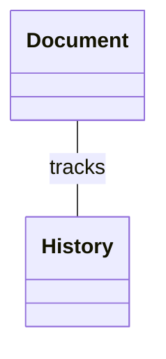

# Mermaid boundary examples

These intentionally exercise unsupported features. Each should show an explicit
explanation and readable source instead of silently omitting meaning.

## Unsupported diagram families

## Unsupported flowchart shape

## Nested sequence frames

## Actor-shaped participants

## Class relationship endpoint cardinalities

## Unmarked class associations

