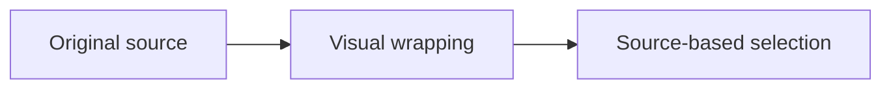

# Smart wrapping and faithful selection

Use the `word wrap` command in Ctrl+K to toggle wrapping. Resize the terminal and switch between view and edit modes. Wrapping never changes this file, and copied text omits display-only indentation and line breaks.

- This is a long unordered list item whose continuation should align with its content rather than starting at the left edge of the screen.
  - This nested list item keeps its extra indentation, including **bold text** and [a link that may cross a wrap boundary](https://example.com/wrapping).
- [x] A long completed task uses hanging indentation after its checkbox. Select it across several visual rows to check that the copied text has no added spaces.
- [ ] Another task with Unicode: 日本語, café, and 👩‍💻 should remain intact when navigating, selecting, and resizing.

1. Numbered lists also align continuation lines with their content, so a long description stays visually grouped with its number.
2. ALongUnbrokenTokenThatMustSplitWithoutInsertingSpacesOrNewlinesWhenCopiedBackToTheClipboard0123456789

Prefix ALongUnbrokenTokenThatStartsAfterSomeTextAndUsesTheRemainingSpaceBeforeContinuingOnTheNextRow0123456789 tail.

> A quote keeps its border on every wrapped line. Selection ignores the repeated border and any padding added by wrapping.
>
> - A list inside a quote combines the quote border with a hanging indent while retaining normal inline Markdown styling and muted text.

> [!TIP]
> Select a wrapped paragraph, then copy it. In edit mode the original source characters are preserved exactly, including real indentation and line breaks.

## Geometry stays intact

| A deliberately wide header that wraps within its column | Another wide header |
| --- | --- |
| Tables wrap individual cells while preserving the grid | Scroll when column minima cannot fit |

```rust
let deliberately_long_code_line = "Code blocks preserve their geometry and remain horizontally scrollable even when prose wrapping is on.";
```


