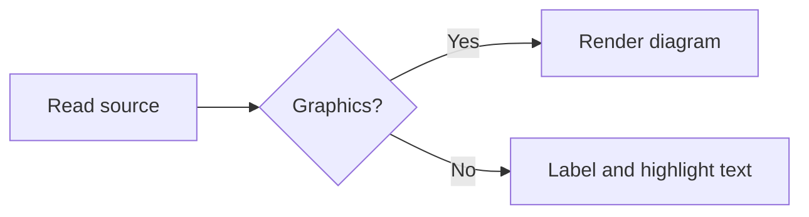

# Code block layout

Resize the terminal, then toggle wrapping with the `word wrap` command in Ctrl+K. Labels, borders,
and continuation indentation are decoration and are excluded from copied text.
The frame starts at the container's left edge. Click `⧉ Copy` at the right edge
to copy the complete block, including off-screen lines and original whitespace.

## Programming languages preserve their layout

```rust
fn describe(name: &str) -> String {
    format!("Hello {name}: this deliberately long programming-language line keeps its original layout and scrolls horizontally.")
}
```

## Prose follows standalone text wrapping

```text
Shopping notes: these words wrap at the available width without adding newlines to the text copied to the clipboard.
  - [x] A long task item continues under its content, preserving only the indentation that actually exists in the source.
    A genuinely indented line keeps its original spaces when selected and copied.

Blank lines also survive copying.
```

## Markdown shown as source

Headings and inline formatting use the edit-mode palette. Source tables and
programming-language sections keep their geometry inside the Markdown sample.

````markdown
# A sample section

Some **bold words**, `inline code`, and a long ordinary paragraph which should wrap just as it does in a standalone Markdown file's edit mode.

| Fixed source table | Another column |
| --- | --- |
| Actual pipes remain | Actual spaces remain |

```rust
let message = "This nested programming-language section remains one source line even when the surrounding prose wraps.";
```
````

## Detection without a language label

```
#!/bin/bash
printf '%s\n' 'Detected from the shebang'
```

## Blocks inside containers

> [!NOTE]
> The code frame is neutral; the surrounding callout keeps its own color.
>
> ```text
>   - Long notes inside a callout use the remaining width and wrap without copying the callout border or code frame.
> ```

> A muted quote can contain syntax-highlighted code:
>
> ```typescript
> const greeting: string = "Hello from inside a quote";
> ```

## Graphics stay unframed


