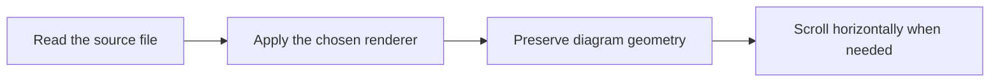

# Optional 120-column limit

Open Ctrl+K and search for "120-column". The toggle is off by default and remembered for Markdown independently of other file types. Turn off normal word wrap to see that the limit still forces text wrapping; turn off the limit to restore ordinary wrapping behavior.

This deliberately long paragraph should use at most 120 terminal columns when the limit is enabled, and fewer when the viewport is narrower. The limit does not insert newlines or spaces into the file, and copying preserves the original paragraph even when it occupies several visual rows.

## Code also follows the limit

```rust
let description = "This deliberately long source line wraps with the optional limit even though programming language files ordinarily preserve their original layout without soft wrapping.";
```

## Tables retain their normal sizing

| First column with a longer descriptive heading | Second column with a longer descriptive heading | Third column with a longer descriptive heading |
| --- | --- | --- |
| Tables still use all available viewport width and their ordinary minimum column widths. | Their layout depends on normal word wrapping, independently of the 120-column setting. | Toggle the column limit and check that this table does not change. |

## Diagrams retain their layout


