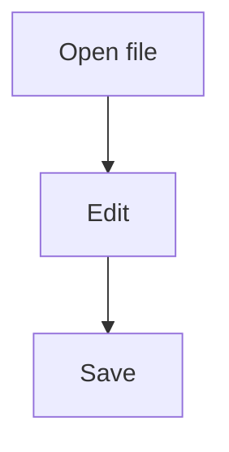
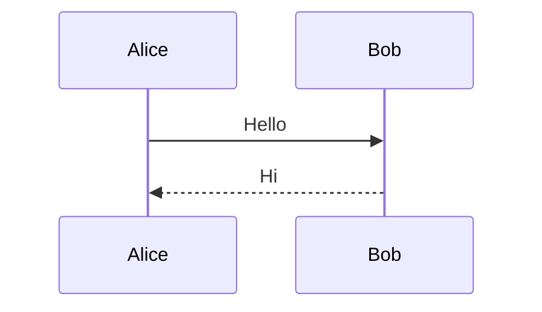

# Editio

A **small** editor for *everyday text*, with `inline code`, ~~strikethrough~~ and [links](https://example.com).

- [x] Keyboard first
- [x] Unicode: 日本語 👩‍💻 café
- [ ] More diagram types

| Mode | Purpose |
| --- | --- |
| View | Read Markdown |
| Edit | Change source |

> [!NOTE]
> Ctrl+K opens the palette; start typing to filter commands.

```rust
fn main() {
    println!("hello");
}
```





A footnote[^one]. Math: $x^2 + y^2$.

[^one]: Kept readable in a terminal.


